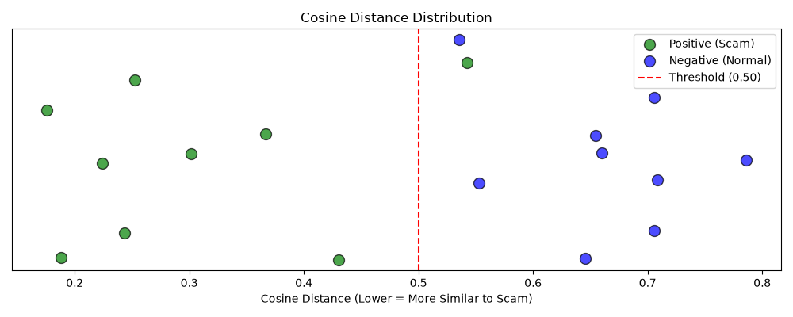

# RAG Threshold Tuning Report

## Methodology
This evaluation tests the RAG (Retrieval-Augmented Generation) vector matching step in isolation. It directly queries the production Supabase database using the HuggingFace embedding model, completely bypassing the LLM reasoning phase. This allows us to mathematically tune the similarity distance threshold to find the optimal balance between catching true scams and ignoring normal conversations.

## Results Table
| Example Text (Truncated) | Expected Category | Matched Category | Distance | Type |
|--------------------------|-------------------|------------------|----------|------|
| Sir I am calling from CBI cyber cell Mumbai. Your Aadhaar ca... | digital_arrest | digital_arrest | 0.252 | POS |
| This is an automated message from the courier company. Your ... | customs_scam | customs_scam | 0.430 | POS |
| Dear customer your electricity connection will be disconnect... | electricity_scam | electricity_scam | 0.188 | POS |
| Congratulations, we are offering you a simple work from home... | work_from_home | work_from_home | 0.176 | POS |
| You borrowed 5000 rupees from our instant loan app last week... | loan_fraud | loan_fraud | 0.244 | POS |
| Hello, this is regarding your bank KYC. Your account will be... | kyc_fraud | kyc_fraud | 0.367 | POS |
| Hi I saw your profile and felt an instant connection, I don'... | romance_scam | impersonation | 0.543 | POS |
| We regret to inform you that your computer has a virus and i... | tech_support_scam | tech_support_scam | 0.301 | POS |
| Congratulations, your mobile number has won 25 lakh rupees i... | lottery_scam | lottery_scam | 0.224 | POS |
| Hey, are you still up for dinner tonight? I was thinking we ... | N/A (Normal) | impersonation | 0.705 | NEG |
| Hi, I'm calling to confirm your appointment with Dr. Mehta t... | N/A (Normal) | impersonation | 0.706 | NEG |
| Good morning, this is regarding the order you placed yesterd... | N/A (Normal) | customs_scam | 0.654 | NEG |
| Mom, I landed safely, the flight was a bit delayed but every... | N/A (Normal) | impersonation | 0.645 | NEG |
| Thanks for calling customer support. I can see your refund r... | N/A (Normal) | impersonation | 0.535 | NEG |
| So the meeting got pushed to 3 PM because half the team is s... | N/A (Normal) | electricity_scam | 0.553 | NEG |
| Hey it's been ages, how have you been? I heard you moved to ... | N/A (Normal) | customs_scam | 0.786 | NEG |
| Your cab is arriving in 3 minutes, a white Swift Dzire, lice... | N/A (Normal) | digital_arrest | 0.709 | NEG |
| This is a reminder that your library books are due for retur... | N/A (Normal) | impersonation | 0.660 | NEG |

## Category Difficulty & Coverage
### Positive Examples Breakdown
| Expected Category | Distance | Matched? |
|-------------------|----------|----------|
| digital_arrest | 0.252 | ✅ Yes |
| customs_scam | 0.430 | ✅ Yes |
| electricity_scam | 0.188 | ✅ Yes |
| work_from_home | 0.176 | ✅ Yes |
| loan_fraud | 0.244 | ✅ Yes |
| kyc_fraud | 0.367 | ✅ Yes |
| romance_scam | 0.543 | ❌ No |
| tech_support_scam | 0.301 | ✅ Yes |
| lottery_scam | 0.224 | ✅ Yes |

### Low Coverage Warning
The following categories have less than 2 seeded examples in the database, meaning they are unvalidated or have low coverage:
- ⚠️ **insurance_scam**
- ⚠️ **job_offer_scam**

## Threshold Sweep
| Threshold | Recall (Pos Kept) | Specificity (Neg Rejected) | Precision | F1 Score |
|-----------|-------------------|----------------------------|-----------|----------|
| 0.15 | 0/9 (0.0%) | 9/9 (100.0%) | 0.0% | 0.000 |
| 0.20 | 2/9 (22.2%) | 9/9 (100.0%) | 100.0% | 0.364 |
| 0.25 | 4/9 (44.4%) | 9/9 (100.0%) | 100.0% | 0.615 |
| 0.30 | 5/9 (55.6%) | 9/9 (100.0%) | 100.0% | 0.714 |
| 0.35 | 6/9 (66.7%) | 9/9 (100.0%) | 100.0% | 0.800 |
| 0.40 | 7/9 (77.8%) | 9/9 (100.0%) | 100.0% | 0.875 |
| 0.45 | 8/9 (88.9%) | 9/9 (100.0%) | 100.0% | 0.941 |
| **0.50** | **8/9 (88.9%)** | **9/9 (100.0%)** | **100.0%** | **0.941** |
| 0.55 | 9/9 (100.0%) | 8/9 (88.9%) | 90.0% | 0.947 |
| 0.60 | 9/9 (100.0%) | 7/9 (77.8%) | 81.8% | 0.900 |

## Distance Distribution

## Findings
<!-- Add your interview notes and interpretation here -->
